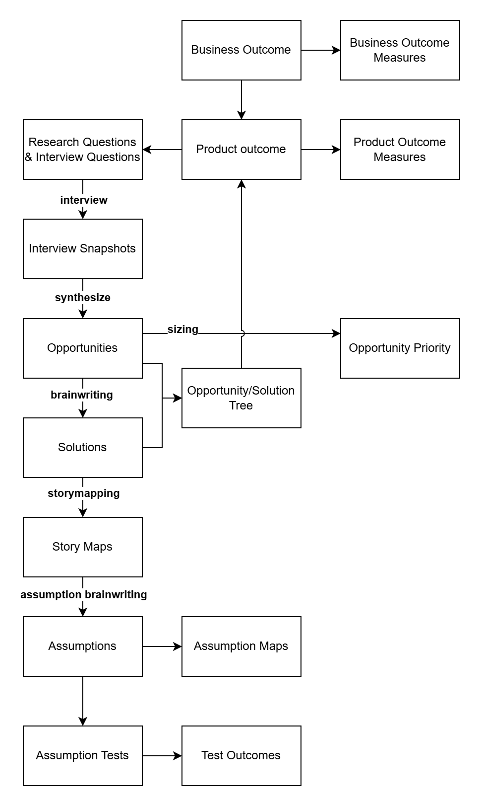

# Design Notes

</img>

Roughing out of data that may need stored

* Projects (<u>ProjectId</u>, Name)
* Outcomes (<u>OutcomeId</u>, ParentOutcomeId, ProjectId, Text, OutcomeTypeId)
* OutcomeType (<u>OutcomeTypeId</u>, Name)
* OutcomeJoiner (<u>LeftOutcomeId</u>, <u>RightOutcomeId</u>, JoinText)
* Measures (<u>MeasureId</u>, OutcomeId, Text, TargetValue)
* RecordedMeasurement (<u>MeasurementId</u>, MeasureId, Value, TimeMeasured)
* ResearchQuestions (<u>ResearchQuestionId</u>, Question, OutcomeId)
* InterviewQuestions (<u>InterviewQuestionId</u>, Question)
* QuestionLinking (<u>ResearchQuestionId</u>, <u>InterviewQuestionId</u>)
* ImageResource (<u>ImageId</u>, EncodedImage)
* Interviewee (<u>IntervieweeId</u>, Name, ProfileImageId)
* InterviewSnapshotInterviewees(<u>SnapshotId</u>, <u>IntervieweeId</u>)
* MemorableQuotes(<u>QuoteId</u>, Quote, InterviewId, IntervieweeId)
* Interviewers (<u>InterviewerId</u>, Name)
* InterviewSnapshot (<u>SnapshotId</u>, Company, RecordingURL, Date, LeadInterviewerId, InterviewQuestionId, ExperienceMapImageId, Story)
* ExperienceMapStages(<u>StageId</u>, SnapshotId, Order, Text)
* SnapshotInterviewers (<u>InterviewerId</u>, <u>SnapshotId</u>)
* InterviewQuickFacts (<u>QuickFactId</u>, InterviewId, Order, Fact)
* InterviewInsights (<u>InsightId</u>, InterviewId, Order, Insight)
* InterviewExhibits (<u>InterviewId</u>, <u>ImageId</u>, Name)
* InterviewOpportunity (<u>InterviewOpportunityId</u>, SourceInterviewId, Text)
* Opportunity (<u>OpportunityId</u>, Text)
* OpportunityOrigin(<u>InterviewOpportunityId</u>, <u>OpportunityId</u>)
* Solutions (<u>SolutionId</u>, OpportunityId, Text)
* StoryMapMoment (<u>StoryMapMomentId</u>, SolutionId, Order)
* Assumption (<u>AssumptionId</u>, StoryMapMomentId, Order)
* AssumptionMapping (<u>AssumptionId</u>, XPriority, YPriority)
* AssumptionTest (<u>AssumptionTestId</u>, AssumptionId, Text)
* AssumptionTestOutcome (<u>AssumptionTestOutcomeId<u>, Text)
* AssumptionTestOutcomeExhibit (<u>AssumptionTestOutcomeId</u>, <u>ImageId</u>)
