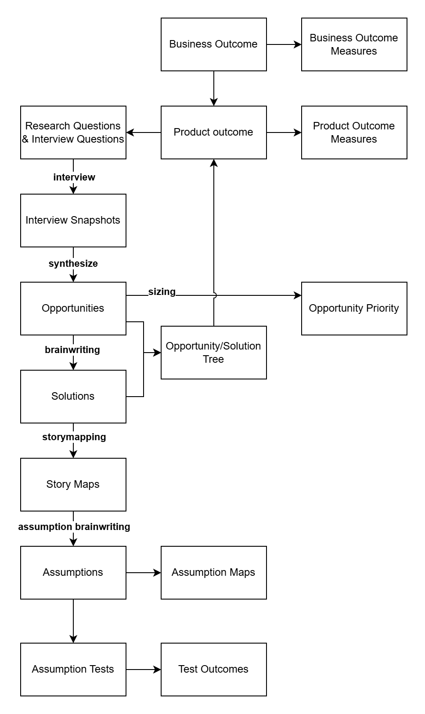

# Design Notes

</img>

Roughing out of data that may need stored

* Projects (<ins>ProjectId</ins>, Name)
* Outcomes (<ins>OutcomeId</ins>, ParentOutcomeId, ProjectId, Text, OutcomeTypeId)
* OutcomeType (<ins>OutcomeTypeId</ins>, Name)
* OutcomeJoiner (<ins>LeftOutcomeId</ins>, <ins>RightOutcomeId</ins>, JoinText)
* Measures (<ins>MeasureId</ins>, OutcomeId, Text, TargetValue)
* RecordedMeasurement (<ins>MeasurementId</ins>, MeasureId, Value, TimeMeasured)
* ResearchQuestions (<ins>ResearchQuestionId</ins>, Question, OutcomeId)
* InterviewQuestions (<ins>InterviewQuestionId</ins>, Question)
* QuestionLinking (<ins>ResearchQuestionId</ins>, <ins>InterviewQuestionId</ins>)
* ImageResource (<ins>ImageId</ins>, EncodedImage)
* Interviewee (<ins>IntervieweeId</ins>, Name, ProfileImageId)
* InterviewSnapshotInterviewees(<ins>SnapshotId</ins>, <ins>IntervieweeId</ins>)
* MemorableQuotes(<ins>QuoteId</ins>, Quote, InterviewId, IntervieweeId)
* Interviewers (<ins>InterviewerId</ins>, Name)
* InterviewSnapshot (<ins>SnapshotId</ins>, Company, RecordingURL, Date, LeadInterviewerId, InterviewQuestionId,
  ExperienceMapImageId, Story)
* ExperienceMapStages(<ins>StageId</ins>, SnapshotId, Order, Text)
* SnapshotInterviewers (<ins>InterviewerId</ins>, <ins>SnapshotId</ins>)
* InterviewQuickFacts (<ins>QuickFactId</ins>, InterviewId, Order, Fact)
* InterviewInsights (<ins>InsightId</ins>, InterviewId, Order, Insight)
* InterviewExhibits (<ins>InterviewId</ins>, <ins>ImageId</ins>, Name)
* InterviewOpportunity (<ins>InterviewOpportunityId</ins>, SourceInterviewId, Text)
* Opportunity (<ins>OpportunityId</ins>, Text)
* OpportunityOrigin(<ins>InterviewOpportunityId</ins>, <ins>OpportunityId</ins>)
* Solutions (<ins>SolutionId</ins>, OpportunityId, Text)
* StoryMapMoment (<ins>StoryMapMomentId</ins>, SolutionId, Order)
* Assumption (<ins>AssumptionId</ins>, StoryMapMomentId, Order)
* AssumptionMapping (<ins>AssumptionId</ins>, XPriority, YPriority)
* AssumptionTest (<ins>AssumptionTestId</ins>, AssumptionId, Text)
* AssumptionTestOutcome (<ins>AssumptionTestOutcomeId<ins>, Text)
* AssumptionTestOutcomeExhibit (<ins>AssumptionTestOutcomeId</ins>, <ins>ImageId</ins>)

After some consideration, I've decided to use MongoDB as a storage medium. I haven't used MongoDB before, but my initial impression is that having a NoSQL database storing JSON will align more closely with the structures I'm
started to build. 

Since I started client/JSON first, it's not a far stretch to shift those structures directly into the
DB as compared to the heavy re-structuring I was going to need to do to normalize and store the data in traditional SQL
tables. I may reconsider later as I have vastly more experience with SQL databases, but for now this is what I will build upon.

